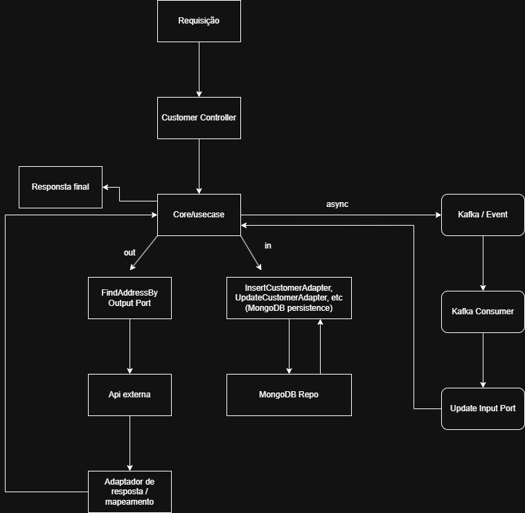

# hexagonal-architecture-studying

Este projeto mostra a arquitetura hexagonal de forma simples.

## Explicação simples

- **Application**
    - **Core**: é onde ficam as regras de negócio. Não tem código de banco, não tem código de API, é o lugar mais limpo e isolado.
        - Casos de uso: são as ações que a aplicação sabe fazer, como inserir, buscar, atualizar ou excluir um cliente.
        - Domínio: são os objetos que representam o cliente, o endereço e as regras importantes sobre eles.
    - **Ports de entrada (in)**: são as interfaces que o core oferece para o mundo externo acionar a aplicação, como os métodos de inserir, buscar, atualizar e excluir.
    - **Ports de saída (out)**: são as interfaces que o core usa para pedir coisas para fora, como salvar no banco, chamar outro serviço ou enviar mensagem.
- **Adapters**
    - **Adapters de entrada (in)**: implementam as ports de entrada e recebem pedidos de fora, como chamadas HTTP ou mensagens Kafka. Eles entram na aplicação e chamam o core.
    - **Adapters de saída (out)**: implementam as ports de saída e fazem a conexão com sistemas externos, como banco de dados, microserviços ou produtores de mensageria.
- **Config**
    - **Usecase**: é onde o Spring monta os casos de uso. Ela cria os objetos do core e conecta cada port com o adaptador correto.
    - **Kafka**: é onde ficam as configurações do Kafka, como produtor, consumidor e serialização das mensagens.

## Como os dados fluem

1. O usuário chama a API HTTP.
2. `CustomerController` cria um `Customer` e chama um input port.
3. O case de uso trata a regra de negócio.
4. Para buscar endereço, o core chama um output port.
5. O adaptador de saída faz a chamada externa e retorna o resultado.
6. Para salvar, o core chama outro output port.
7. O adaptador salva no MongoDB.

### Arquitetura em imagem

## Por que isso é hexagonal?

- O core não sabe se os dados vêm de REST, Kafka ou outro lugar.
- O core não sabe como os dados são salvos ou enviados.
- Ele depende apenas de interfaces (`ports`).
- Os adaptadores ficam na borda do sistema e implementam essas interfaces.

## Exemplo rápido

- `CustomerController` usa `InsertCustomerInputPort`.
- `InsertCustomerUseCase` usa `FindAddressByZipCodeOutputPort` e `InsertCustomerOutputPort`.
- `FindAddressByZipCodeAdapter` chama a API externa.
- `InsertCustomerAdapter` salva no banco.
- `SendCpfValidationAdapter` envia CPF para Kafka.

Isso deixa a parte de negócio isolada e fácil de testar.
